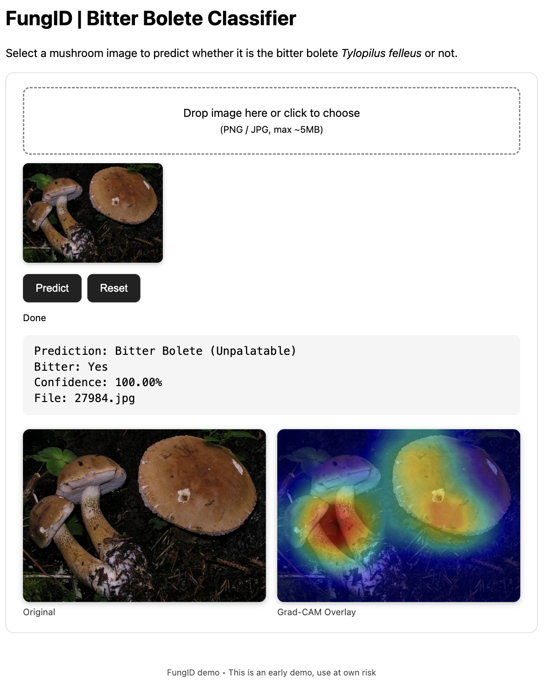

# FungID: Deep Learning & Explainable AI for Bitter Bolete Identification

FungID is a computer vision + FastAPI demo project that classifies bolete mushroom images and highlights the visual evidence the model used (Grad-CAM heatmaps). The primary safety task: distinguish edible boletes (*Boletus edulis*, *Imleria badia*) from the inedible, meal‑ruining bitter bolete (*Tylopilus felleus*).

> Educational / research use only. Do **not** rely on this as a sole source for edible mushroom decisions! Always consult qualified mycological references.

## Problem Statement

Mushroom identification is crucial for foragers and food safety. This project tackles the binary classification problem of distinguishing:

- **Edible boletes**: *Boletus edulis* (porcini), *Imleria badia* (bay bolete)
- **Bitter bolete**: *Tylopilus felleus* (bitter bolete) - inedible and extremely bitter

Misidentification can ruin a whole meal even if only a single small bitter bolete is contained. Making accurate automated classifications therefore is a valuable additional tool for identifying the inedible bolete.

## Technical Approach

### Dataset
- **Source**: [MushroomObserver](https://mushroomobserver.org/) community database
- **Size**: 1,411 high-quality images across 3 species
- **Distribution**: 
  - *Boletus edulis*: 594 images
  - *Imleria badia*: 218 images  
  - *Tylopilus felleus*: 599 images
- **Split**: 70% training, 15% validation, 15% testing

### Model Architecture
- **Base Model**: ResNet18 (ImageNet pre-trained weights)
- **Transfer Learning**: Final fully-connected layer replaced for 2 classes
- **Input**: 299×299 RGB images (Albumentations preprocessing)
- **Output**: Binary logits → softmax (edible vs. bitter)

### Explainability (Grad-CAM)
For every API prediction a Grad-CAM heatmap is generated over the final convolutional block (`layer4`) and alpha‑blended with the original image. Returned as a base64 PNG string. This enables quick trust/quality assessment and spotting failure modes (e.g. background bias).

### Training Strategy
- **Loss**: CrossEntropyLoss
- **Optimizer**: Adam (gradient accumulation to simulate large batch)
- **Scheduler**: ReduceLROnPlateau (val loss)
- **Selection Metric**: Validation Recall (maximize bitter bolete detection)
- **Additional Metrics**: Accuracy, AUROC
- **Checkpointing**: Per epoch + best (by recall)

## Results

The model achieves strong performance on the test set:

- **Recall**: Optimized for detecting bitter boletes (safety-critical)
- **AUROC**: Comprehensive binary classification performance
- **Model Selection**: Best checkpoint based on validation recall

*Detailed performance metrics and visualizations available in `04_model_evaluation.ipynb`*

## Usage Overview

See `INSTALL.md` for environment setup. Below: notebook workflow, direct Python inference, and the web API.

### Running the Pipeline

1. **Data Acquisition** (`01_dataset_acquisition.ipynb`)
   - Download dataset catalog from MushroomObserver
   - Filter species by image count thresholds
   - Scrape images for selected species

2. **Data Preparation** (`02_dataset_preparation.ipynb`)
   - Create train/validation/test splits
   - Generate binary classification labels
   - Export dataset splits as CSV files

3. **Model Training** (`03_model_training.ipynb`)
   - Configure ResNet18 architecture
   - Train with transfer learning
   - Monitor metrics and save checkpoints

4. **Model Evaluation** (`04_model_evaluation.ipynb`)
   - Load best model checkpoint
   - Generate performance metrics
   - Create confusion matrix and ROC curves

5. **Inference** (`05_model_inference.ipynb`)
   - Interactive image classification
   - Real-time prediction interface
   - Confidence scoring

### Quick Inference (Python API + Heatmap)
```python
from fungid.backend.model_inference import image_classification

CLASS_LABELS = {0: "Non-bitter Bolete (Edible)", 1: "Bitter Bolete (Unpalatable)"}

result = image_classification(
      image_path="path/to/mushroom.jpg",
      model_path="checkpoints/ResNet18_best_model.pth",
      model_name="ResNet18",
      number_classes=2,
      class_labels=CLASS_LABELS,
      return_heatmap=True,
)

print(result["class_name"], f"{result['confidence']:.1%}")
if "heatmap_overlay" in result:
      # heatmap_overlay is a base64 PNG string
      import base64, io, PIL.Image as Image
      img = Image.open(io.BytesIO(base64.b64decode(result["heatmap_overlay"])))
      img.show()
```

### Running the FastAPI Server
```bash
uvicorn fungid.backend.main:app --reload --port 8000
```
Then open: http://localhost:8000/ (static demo UI) or http://localhost:8000/docs (OpenAPI docs).

### HTTP Prediction Example
```bash
curl -X POST -F "file=@test_images/marone_01.jpg" http://localhost:8000/predict | jq
```
Example JSON (truncated):
```json
{
   "class_name": "Non-bitter Bolete (Edible)",
   "is_bitter": false,
   "confidence": 0.9731,
   "filename": "marone_01.jpg",
   "heatmap_overlay": "iVBORw0KGgoAAA..."  
}
```

### Web UI
Drag & drop an image → side‑by‑side display: Original vs Grad‑CAM overlay.

Screenshot preview:



## Project Structure

```
FungID/
├── fungid/                               # Package
│   ├── backend/                          # FastAPI backend + static UI
│   │   ├── main.py                       # API entrypoint
│   │   ├── model_inference.py            # Inference + Grad-CAM (API version)
│   │   ├── models.py                     # Pydantic response schemas
│   │   └── static/
│   │       ├── index.html                # Minimal drag & drop web client
│   │       └── preview_screenshot.png    # (Add manually) UI preview image
├── utils/                                # Core training & classic inference utilities
│   ├── dataset_acquisition.py            # Data downloading and scraping
│   ├── dataset_preparation.py            # Data splitting utilities
│   ├── image_dataset.py                  # PyTorch dataset and transforms
│   ├── model_training.py                 # Training loop and model utilities
│   ├── model_inference.py                # (original inference helper, no heatmap)
│   └── logger.py                         # Logging configuration
├── checkpoints/                          # Saved epoch + best model weights
├── data/                                 # CSV splits, images, metadata
├── 01_dataset_acquisition.ipynb
├── 02_dataset_preparation.ipynb
├── 03_model_training.ipynb
├── 04_model_evaluation.ipynb
├── 05_model_inference.ipynb
├── requirements.txt
├── INSTALL.md
└── README.md
```

## Possible Future Improvements

- Multi-class expansion (more bolete + non-bolete species)
- Additional explanation methods (e.g., Score-CAM, LIME, Integrated Gradients)
- Lightweight mobile / on-device (CoreML / TFLite) deployment
- Active learning loop (flag low-confidence images for manual labeling)
- Incorporate contextual metadata (location, season) for re-ranking

## Acknowledgments

- [MushroomObserver](https://mushroomobserver.org/) community dataset
- PyTorch & TorchVision (ResNet weights)
- Albumentations for fast image augmentations
- FastAPI + Uvicorn for serving predictions & explainability

---